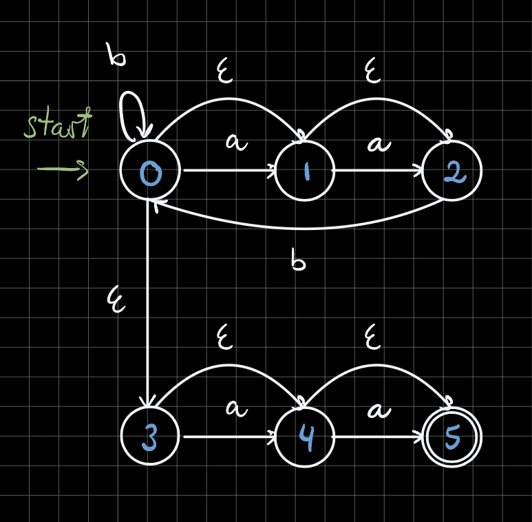
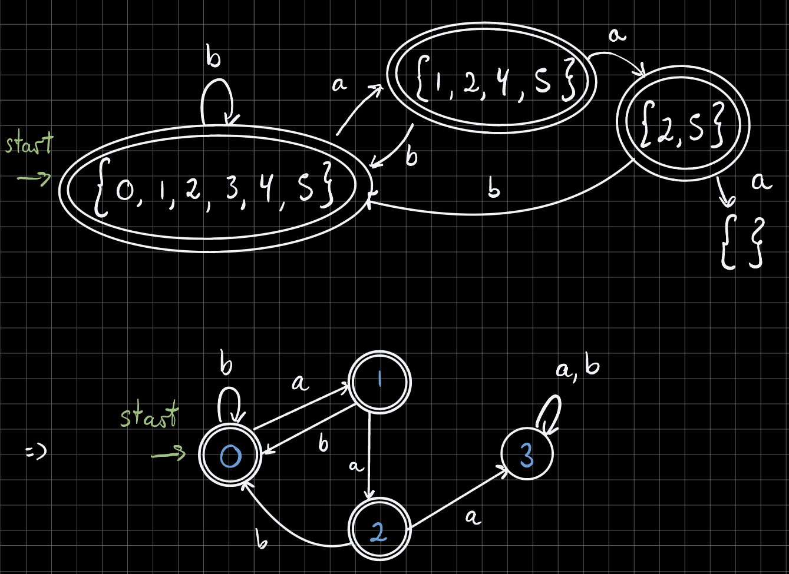
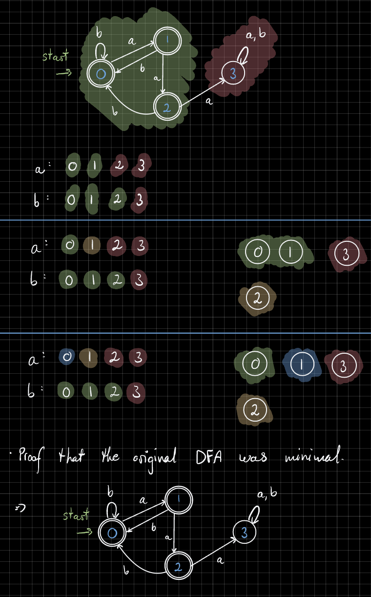
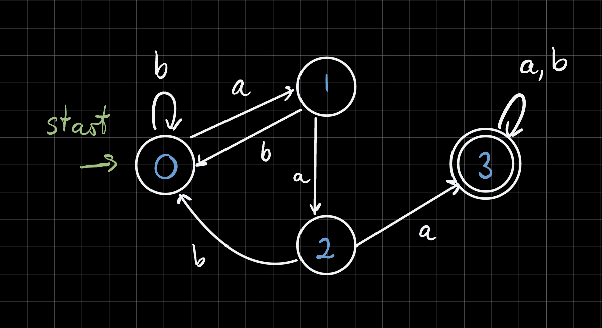
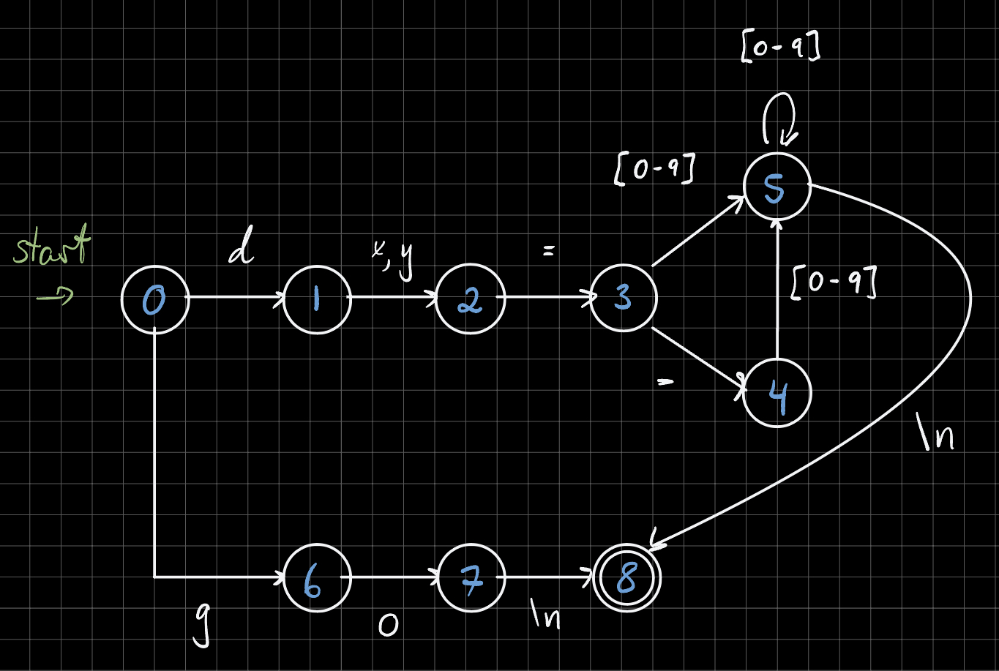

# Assignment 1

## 1 - Regular expressions, NFAs and DFAs

### 1.1

Given the language `L` with all strings over the alphabet `{a, b}`, with no more than 2 consecutive `a`'s in a row.

Below follows a regular expression that matches the string:

```ts
(b*(a?a?)b+)*a?a?
```

### 1.2



### 1.3



### 1.4



### 1.5

**How would you go about creating a DFA matching `L∗`, given that we already have a DFA matching `L`?.**

To create a DFA matching the complement `L*`, given that we already have a DFA matching `L`, we can simply invert the DFA.



**Produce a regular expression that matches `L*`.**

The regular expression that matches `L*` is:

```ts
((b*a)+a)+a(a|b)*
```

To find this regular expression, we backtrack through the DFA that matches `L*`:

- `(a|b)*` matches the empty string, or any number of `a`'s or `b`'s. This corresponds to state 3.
- The `a` before `(a|b)*` corresponds to the edge between state 2 and state 3.
- The group `((b*a)+a)+` corresponds to the flow from state 0 to state 1 to state 2.

This regular expression was tested against the provided tests, and marked every test as red. This is the expected behavior, since the regular expression matches `L*`, which is the complement of `L`.

**Between DFAs and regexes, which was the easiest to invert to the “opposite” language?**

The DFA was the easiest to invert to the "opposite" language, since it is a simple matter of inverting the accepting and non-accepting states.

## 2 - DFA for a small language

### 2.1

The following regular expression matches exactly one statement on the provided format:

```ts
dx\=\-?([0-9]+)\ndy\=\-?([0-9]+)\ngo\n
```

Breaking the regular expression down, we have:

- `dx\=\-?([0-9]+)` matches the first line, which is the x-coordinate of the destination. This allows an optional `-` sign, followed by one or more digits.
- `dy\=\-?([0-9]+)` matches the second line, which is the y-coordinate of the destination. This allows an optional `-` sign, followed by one or more digits.
- `go\n` matches the third line, which is the command to execute the movement.

Note that special characters like `\` and `-` must be escaped in the regular expression.

### 2.2



### 2.3

Please see the attached implementation details. Run the application using:

```sh
# Navigate to the project directory
cd assignment-1

# Compile and generate the executable
make

# Generate the spiral and the PDF
cat spiral.txt | ./scanner | ps2pdf - spiral.pdf

# Open the PDF
open spiral.pdf
```

Note that the erroneous line in `spiral.txt` is line 5890, with the content `dx==-3` (double `=`).
