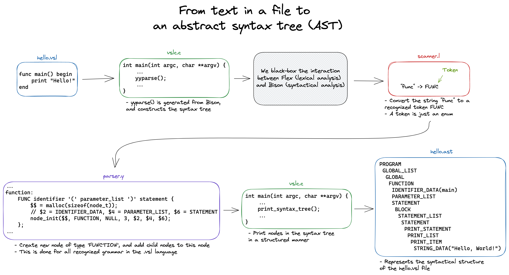

# Assignment 2

## 1 - Top-down parsing table

The deliverable for the theoretical questions can be found in the file [`theory/ps2.pdf`](./theory/ps2.pdf).

## 2 - VSL specification

Please see the attached implementation details. Run the application using:

```sh
# Navigate to the code
cd code/vslc

# Clean and compile source code
make purge && make

# Navigate to the directory of .vsl files used for validating
cd vsl_programs

# Clean and check the generated syntax tree (*.ast) with the expected one (*.ast.suggested)
make clean && make check
```

**Observe that all the tests pass, and that no differences are found between the generated and expected syntax trees.**

### From text in a file to an abstract syntax tree (AST)



Above, you can see a **very** simplified overview of the process of parsing a VSL program.
