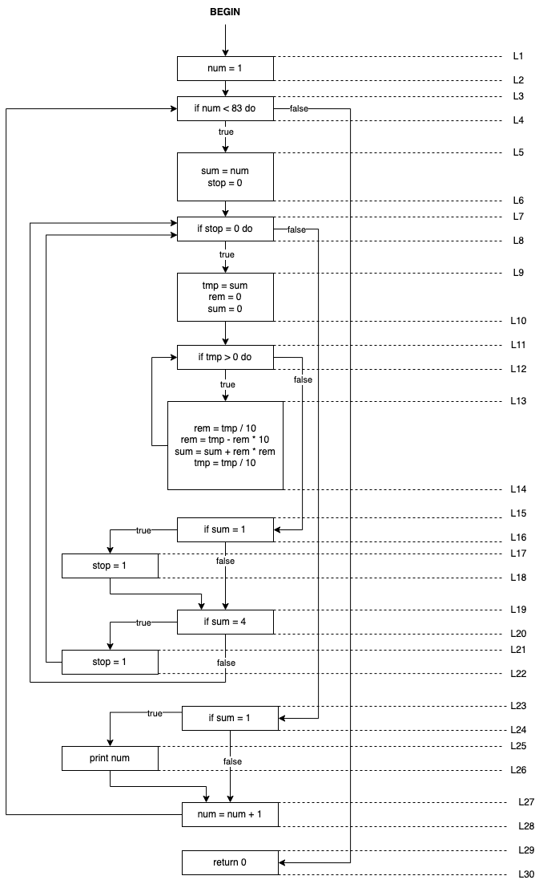
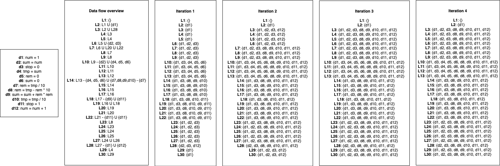

# 1 - Data flow analysis

Note that I cooperated with Johan Solbakken on this task.

## 1.1 - Control flow graph

Below, you can see the control flow graph for the `happy_numbers` program, with the program points labeled.

## 1.2 - Reaching definitions

Based on this control flow graph, we can now state and solve the data flow equations for the "reaching definitions" analysis:

